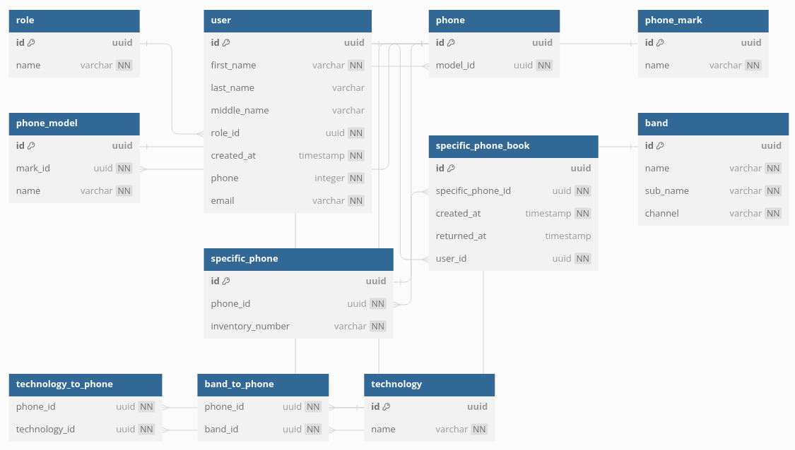

# Getting Started

## DB Schema:

## Setup dependencies and base project
### OS (Ubuntu)
    sudo apt-get install nodejs npm
    npm install @openapitools/openapi-generator-cli -g

### Back-end

#### Generate DTOs and interfaces from OpenAPI specification
    brew install openapi-generator
    openapi-generator generate -g spring -o generated --api-package com.fdobrotv.testphonebooking.api --invoker-package com.fdobrotv.testphonebooking.invoker --model-package com.fdobrotv.testphonebooking.dto -i specs/testphonebooking-v1.0.yaml

#### Setup local development env
    brew install docker-compose
    brew install colima
    brew install libpq
    
    # delete existing instance!
    colima delete 
    colima start

## Development run

### Environment
    docker-compose up

### Back-end
    ./gradlew bootRun

### To validate
    docker-compose down -v postgres
    docker-compose up postgres

### Run test via IDE or gradle
    :test --tests "com.fdobrotv.testphonebooking.ControllerTests.informationAboutSpecificPhoneByIdProvidedTest"

    